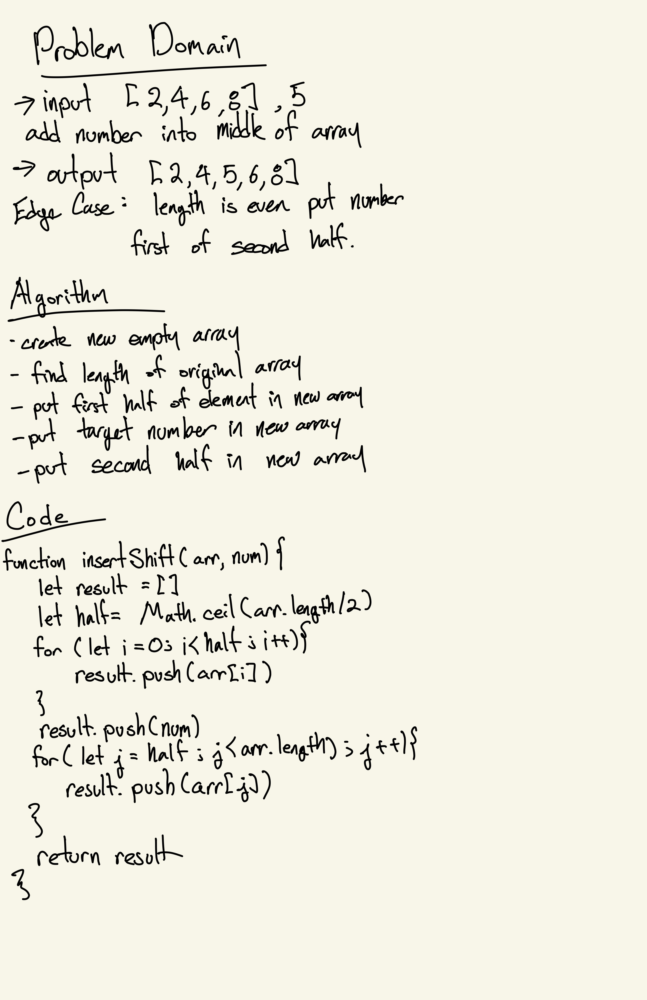

# Challenge Summary
<!-- Short summary or background information -->
Creating a function that accepts an array and number and insert the number in the middle of the array.
## Challenge Description
<!-- Description of the challenge -->
Same as above?
## Approach & Efficiency
<!-- What approach did you take? Why? What is the Big O space/time for this approach? -->
I created a new empty array and added the first half of the original array. Then I added the given number to the new array. Finally adding the other half of the original array to the new array.
## Solution
<!-- Embedded whiteboard image -->
