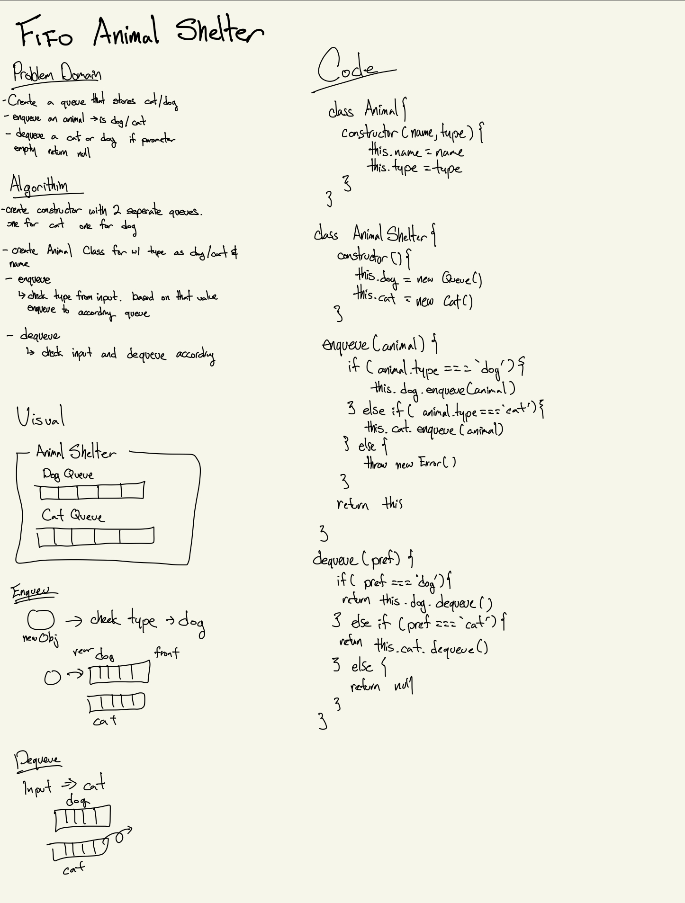

# Challenge Summary
<!-- Short summary or background information -->
Create a queue that stores dogs and cats
## Challenge Description
<!-- Description of the challenge -->
Able to store dogs and cats. It should operate using a first-in first-out.
## Approach & Efficiency
<!-- What approach did you take? Why? What is the Big O space/time for this approach? -->

## Solution
<!-- Embedded whiteboard image -->

