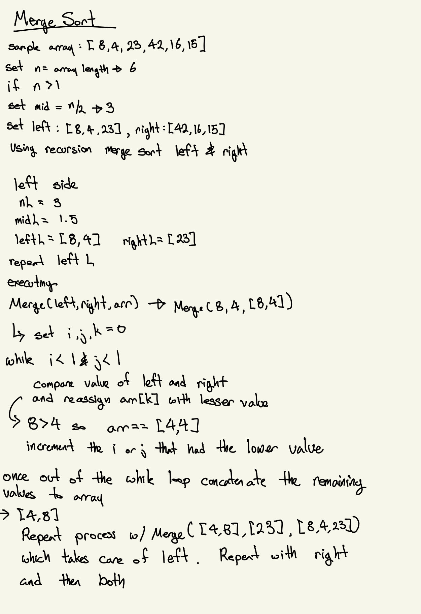

# Merge Sort

## Pseudo-code 
```
ALGORITHM Mergesort(arr)
    DECLARE n <-- arr.length
           
    if n > 1
      DECLARE mid <-- n/2
      DECLARE left <-- arr[0...mid]
      DECLARE right <-- arr[mid...n]
      // sort the left side
      Mergesort(left)
      // sort the right side
      Mergesort(right)
      // merge the sorted left and right sides together
      Merge(left, right, arr)

ALGORITHM Merge(left, right, arr)
    DECLARE i <-- 0
    DECLARE j <-- 0
    DECLARE k <-- 0

    while i < left.length && j < right.length
        if left[i] <= right[j]
            arr[k] <-- left[i]
            i <-- i + 1
        else
            arr[k] <-- right[j]
            j <-- j + 1
            
        k <-- k + 1

    if i = left.length
       set remaining entries in arr to remaining values in right
    else
       set remaining entries in arr to remaining values in left
```
## Algorithm
1. Set `n` as the length of the array.
2. if `n>1` set `mid` as `n/2` and assign `left = [0...mid` and  `right = [mid...n]`.
3. Use recursion to merge sort both `left` and `right`.
4. Create function to merge left,right, and array.
5. Set `i,j,k = 0`.
6. While `i < left length` and `j < right length` compare `left[i]` and `right[j]`.
7. Set `array[k]` with the lesser value and increment `i` or `j` whatever had lesser value and increment `k`.
8. Once while loop finishes, set remaining entries in arr to remaining values of either `left` or `right.
9. Apply `merge` function with `left`, `right`, and `array`.

## Visual
