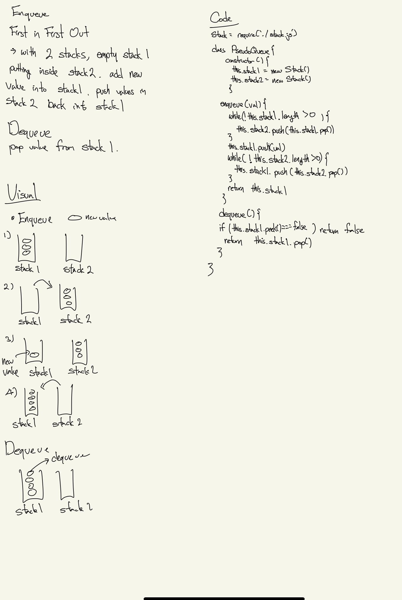

# Challenge Summary
<!-- Short summary or background information -->
Create a queue using two stacks
## Challenge Description
<!-- Description of the challenge -->

## Approach & Efficiency
<!-- What approach did you take? Why? What is the Big O space/time for this approach? -->
### Enqueue 
- Move all items in stack 1 to stack 2
- Add new value to stack 1
- Move items in stack 2 back to stack 1
- O(n) for time complexity

### Dequeue
- Pop item from stack
- O(1) for time complexity
## Solution
<!-- Embedded whiteboard image -->

