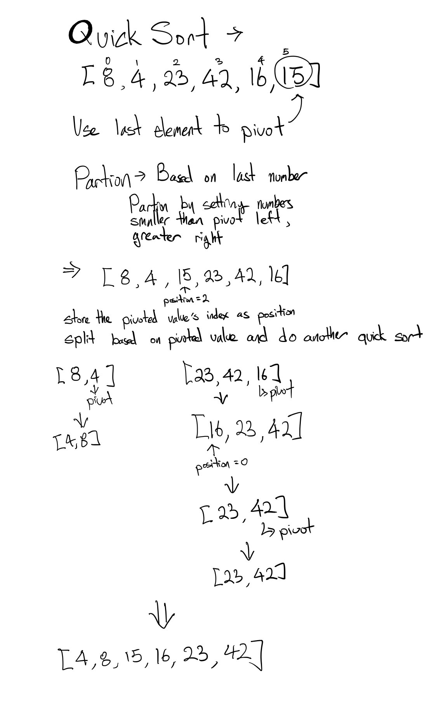

# Quick Sort

## Pseudo Code
```
ALGORITHM QuickSort(arr, left, right)
    if left < right
        // Partition the array by setting the position of the pivot value 
        DEFINE position <-- Partition(arr, left, right)
        // Sort the left
        QuickSort(arr, left, position - 1)
        // Sort the right
        QuickSort(arr, position + 1, right)

ALGORITHM Partition(arr, left, right)
    // set a pivot value as a point of reference
    DEFINE pivot <-- arr[right]
    // create a variable to track the largest index of numbers lower than the defined pivot
    DEFINE low <-- left - 1
    for i <- left to right do
        if arr[i] <= pivot
            low++
            Swap(arr, i, low)

     // place the value of the pivot location in the middle.
     // all numbers smaller than the pivot are on the left, larger on the right. 
     Swap(arr, right, low + 1)
    // return the pivot index point
     return low + 1

ALGORITHM Swap(arr, i, low)
    DEFINE temp;
    temp <-- arr[i]
    arr[i] <-- arr[low]
    arr[low] <-- temp
```

## Algorithm
1. Create a function `swap` that accepts an array and two indexes such that it swaps the position of the two.
2. Create a function `partition` that takes in an array with two indexes.
3. `partition` should set the end index value as a pivot and have values that are less than pivot to the left of it and values greater to the right of pivot using `swap`
4. Return the updated index where the pivot value is located.
5. Create a function `quicksort` which takes in an array and the starting index and ending index of the array.
6. Run `partition` within `quicksort` and store that value as `position`.
7. Apply a recursive function `quicksort` accepting the same array with the starting index and `position`-1.
8. Apply a recursive function `quicksort` accepting the same array with the `position`+1 and ending index.

## Visual
